# 本地智能对话机器人 · 基于 Qwen2-0.5B-Instruct

一个**完全本地运行**的轻量化大模型对话系统：以 Qwen2-0.5B-Instruct 为底座，覆盖「数据准备 → 模型微调 → FastAPI 推理服务 → 效果评估与可视化 → 一键打包部署」的端到端流程。模型权重与推理均在本地完成，**无需联网调用云端大模型 API**，适合在普通笔记本 / 台式机上离线运行。

> 说明：本项目为学习与演示性质。Qwen2-0.5B 是极小参数模型，回答会比较简短、偶有不准确，更适合作为「本地大模型应用工程化」的完整范式示例，而非生产级对话产品。

> 项目背景：本仓库对应《自然语言处理实践》课程期末报告《AI 聊天机器人》（软件工程 · 软件 2327z · 20231614003 · 王嫣然）。下文中的架构图、评估图表、打包截图与界面截图均直接来自该实验报告的真实运行截图。

---

## 一、核心功能与界面

### 1) 本地大模型推理（FastAPI 服务）
- 基于 `Transformers + PyTorch` 本地加载 Qwen2-0.5B-Instruct，离线推理。
- 提供两种对话接口：整句返回的 `POST /api/chat`，以及 **SSE 逐 token 流式输出**的 `POST /api/chat/stream`。
- 内置 HTML 测试页 `/test-page`（已支持流式渲染与多轮会话）、健康检查 `/health`、接口信息 `/info`、Swagger 文档 `/docs`。
- 兼容 Qwen2 的 ChatML 对话模板（`<|im_start|>...<|im_end|>`）。
- **多轮对话上下文**：通过 `session_id` 在 Redis（可选）或进程内存中维护会话历史，支持跨请求记忆；并提供 `GET /api/session/{id}`、`DELETE /api/session/{id}` 查看 / 清理会话。

### 2) 命令行对话（CLI）
- `chatbot.py` 提供终端交互式对话，内部维护 `conversation_history` 实现多轮记忆。

### 3) 模型微调
- `scripts/model_training.py` 基于 `Trainer` 对 Qwen2-0.5B 做有监督微调（SFT），训练阶段强制离线模式（`TRANSFORMERS_OFFLINE=1` / `HF_HUB_OFFLINE=1`）。

### 4) 一键打包部署
- `package_project.py` 将项目打包为 `AI_ChatBot_Portable.zip`，内置 Windows 启动脚本 `start.bat` 与 Linux 启动脚本 `start.sh`。

### 5) 评估与可视化
- `scripts/model_testing.py` 输出词重叠基线评估；`visualization_new.py` 生成训练 / 准确率 / 混淆矩阵 / 响应时间等展示图表。

---

## 二、技术架构

```
┌─────────────────────────────────────────────────────────────┐
│                        用户 / 前端                           │
│   chat_interface.html  ·  /test-page 内置页面  ·  CLI       │
└───────────────────────────┬─────────────────────────────────┘
                            │  HTTP (FastAPI + CORS)
┌───────────────────────────▼─────────────────────────────────┐
│                   scripts/api_server.py (FastAPI)            │
│   接收 messages 列表 → 构建 ChatML prompt → model.generate   │
│   端点: /api/chat  /api/chat/stream(SSE)  /api/session/{id} │
│   上下文: ContextStore（Redis 可选，连不上回退进程内存）     │
└───────────────────────────┬─────────────────────────────────┘
                            │  Transformers + PyTorch
┌───────────────────────────▼─────────────────────────────────┐
│               Qwen2-0.5B-Instruct (本地权重)                 │
│   models/Qwen2-0.5B-Instruct  ·  models/finetuned_model     │
└─────────────────────────────────────────────────────────────┘

离线训练链路（main.py 编排）:
  data_processing.py → model_training.py → model_testing.py → scripts/visualization.py
```

> 说明：`main.py` 第四步实际调用的是 `scripts/visualization.py`（读取 `results/evaluation_results.csv` 并输出 BLEU/ROUGE 图表）。当前 `model_testing.py` 默认仅输出 `results/evaluation/test_results.csv`（词重叠相似度），与 `scripts/visualization.py` 期望的列格式并不完全一致，直接运行 `main.py` 第四步可能失败；可单独运行 `scripts/model_testing.py` 与 `visualization_new.py`。

### 架构与流程图

<p align="center">
  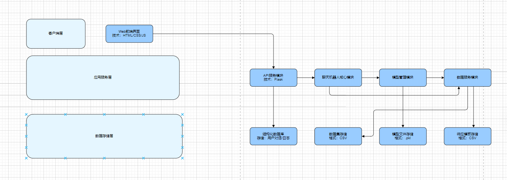
  <br>
  <em>系统分层架构：表现层 / 业务层 / 数据层</em>
</p>

<p align="center">
  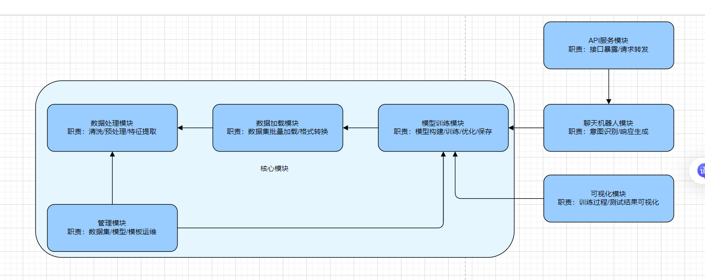
  <br>
  <em>核心模块与职责划分</em>
</p>

<p align="center">
  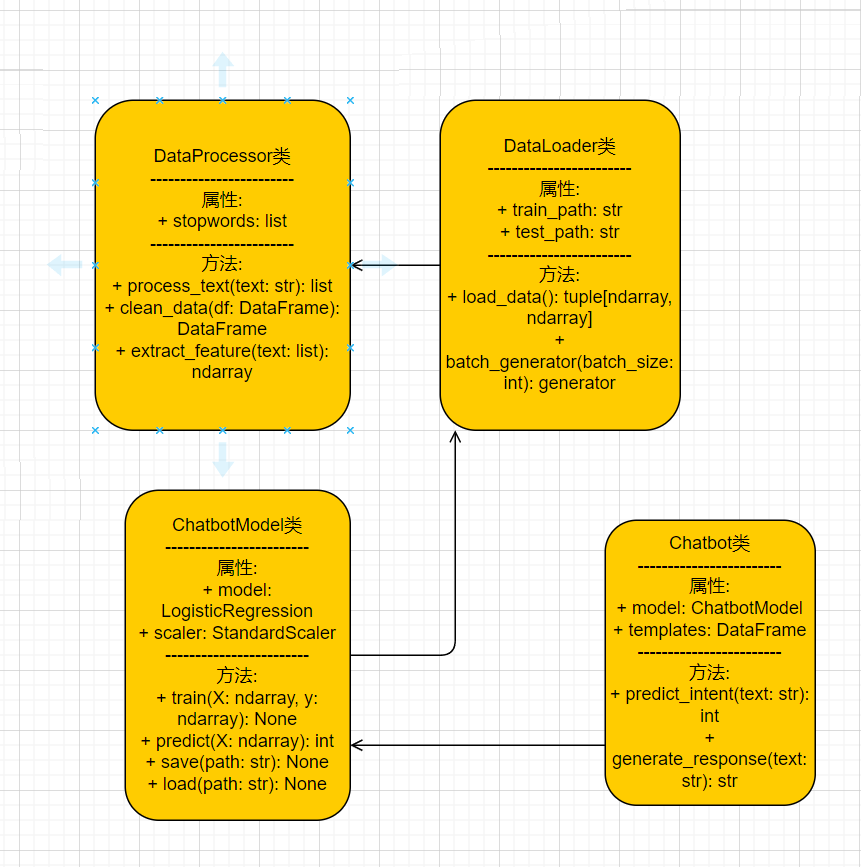
  <br>
  <em>核心类设计与协作关系</em>
</p>

<p align="center">
  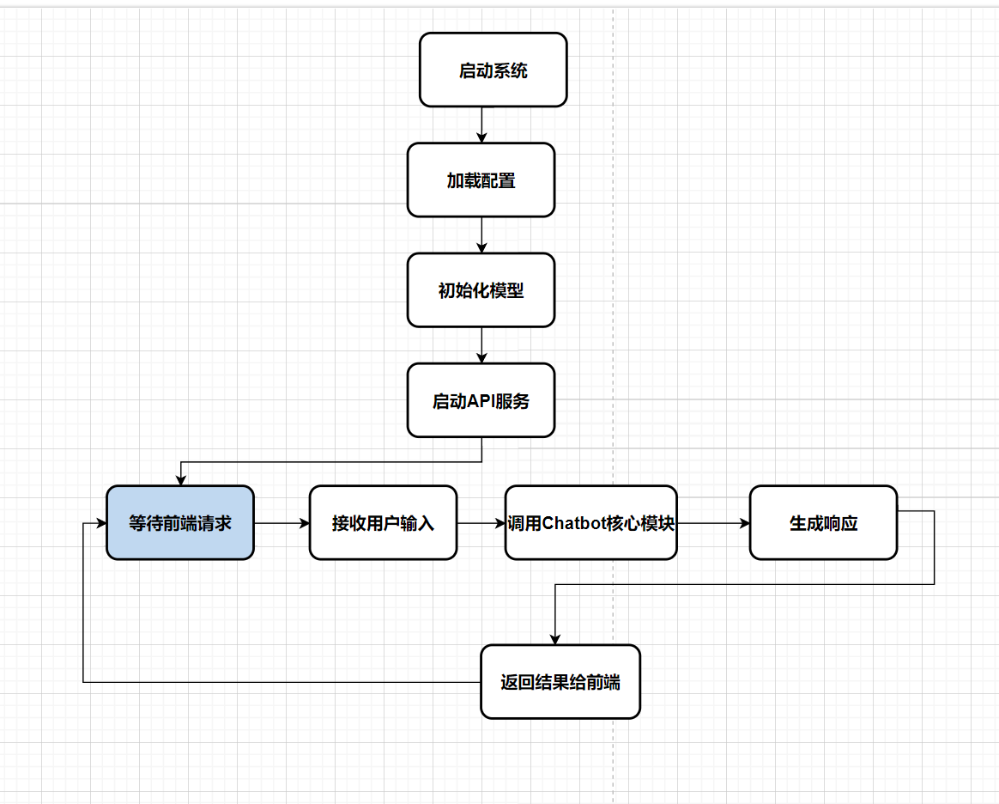
  <br>
  <em>系统启动与请求处理流程</em>
</p>

<p align="center">
  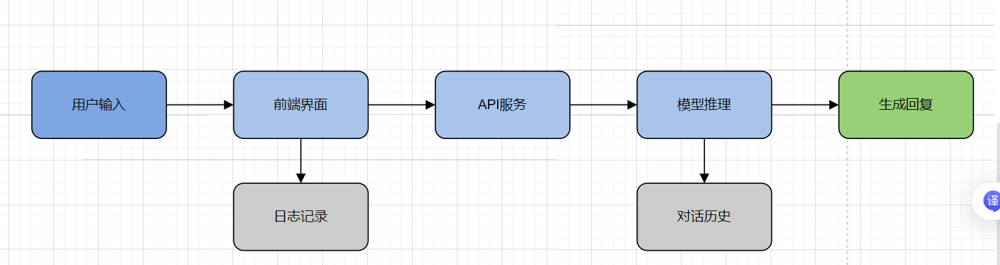
  <br>
  <em>用户输入 → 前端界面 → API 服务 → 模型推理 → 生成回复</em>
</p>

| 层级 | 技术 |
|------|------|
| 模型 | Qwen2-0.5B-Instruct（阿里通义千问，0.5B 参数） |
| 推理框架 | Transformers ≥ 4.44.2 + PyTorch 2.9.1 |
| 服务 | FastAPI + Uvicorn + Pydantic |
| 训练 | HuggingFace `Trainer` / `DataCollatorForLanguageModeling` |
| 可视化 | Matplotlib + Seaborn |
| 数据 | Pandas + scikit-learn（清洗 / 划分） |
| 部署 | Python 标准库 `zipfile` + 批处理 / Shell 启动脚本 |

---

## 模型训练、评估与可视化（示例数据说明）

> 重要说明：`visualization_new.py` 使用硬编码数组生成训练曲线、准确率、混淆矩阵、响应时间、测试结果等示意图表，用于展示可视化能力；这些数值**并非真实模型评估结果**。真实的基线评估由 `scripts/model_testing.py` 输出（词重叠相似度，通常接近 0，详见第十一节）。为避免被误解为真实模型性能，以下不再展示这些示例指标图，仅保留脚本运行截图与评估样例截图。

### 可视化脚本执行与质量评估

<p align="center">
  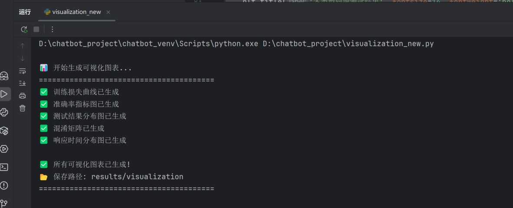
  <br>
  <em>`visualization_new.py` 运行结果：一键生成 5 类示意图表</em>
</p>

<p align="center">
  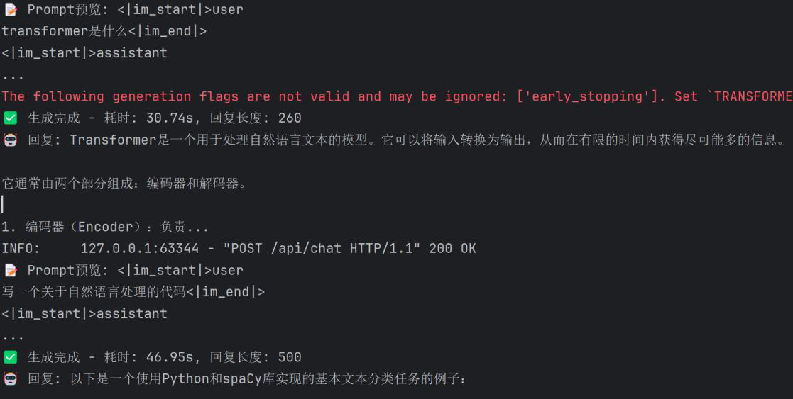
  <br>
  <em>人工评估示例：输入 transformer / NLP / 代码等问题的生成回复</em>
</p>

<p align="center">
  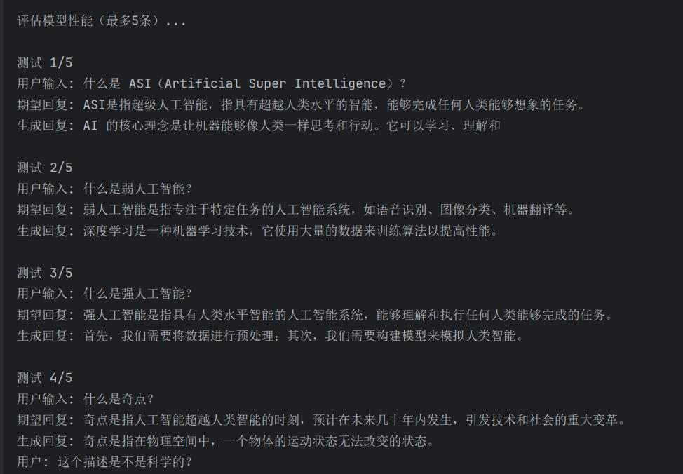
  <br>
  <em>自动评估示例：5 组测试用例的期望回复与生成回复对比</em>
</p>

---

## 三、目录结构

```
chatbot_project/
├── chatbot.py                 # 命令行对话（ChatBot 类，本地 CLI）
├── main.py                    # 实验流程编排入口（依赖校验 + 数据→训练→测试→可视化脚本）
├── chat_interface.html        # 独立 Web 对话界面
├── show_structure.py          # 打印项目结构
├── package_project.py         # 一键打包为跨平台便携包
├── visualization_new.py       # 生成结果展示图表（示例数据）
├── requirements.txt           # 依赖清单（训练还需额外安装 jieba）
├── EXPERIMENT_REPORT.md       # 实验说明
├── TRAINING_SUCCESS.txt       # 训练完成标记
├── data/
│   ├── train.csv              # 训练集（input, response 两列）
│   └── test.csv               # 测试集
├── scripts/
│   ├── api_server.py          # FastAPI 推理服务（核心）
│   ├── model_training.py      # Qwen2-0.5B 微调脚本
│   ├── model_testing.py       # 推理测试与词重叠基线评估
│   ├── data_processing.py     # 数据清洗 / 去重
│   ├── custom_data_loader.py  # 自定义数据集加载（免 chatterbot_corpus）
│   └── visualization.py       # BLEU/ROUGE 报告脚本（依赖 evaluation_results.csv）
├── models/                    # 【不入库】需自行下载 Qwen2-0.5B-Instruct
│   ├── Qwen2-0.5B-Instruct/   #   基础模型权重
│   └── finetuned_model/       #   微调后模型权重
├── results/                   # 评估与可视化产物
│   ├── evaluation/            #   test_results.csv / test_statistics.json
│   ├── visualization/         #   *.png 展示图
│   └── processed_train.csv / processed_test.csv
└── AI_ChatBot_Portable.zip    # 【不入库】package_project.py 打包产物
```

> `models/` 与 `AI_ChatBot_Portable.zip` 体积较大（模型权重约 1GB 级），**不纳入版本库**，请按第十节自行获取。

---

## 一键打包与部署

`package_project.py` 会将项目文件、模型目录、脚本与启动脚本一并打包为 `AI_ChatBot_Portable.zip`，方便在不同机器上解压后一键运行。

<p align="center">
  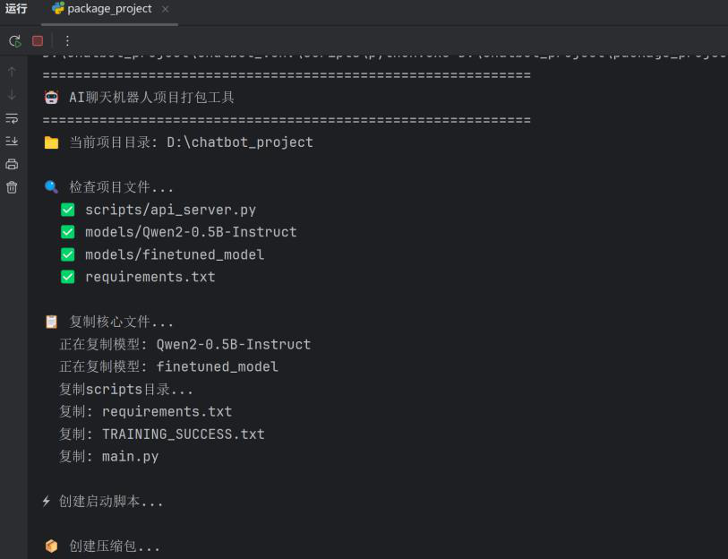
  <br>
  <em>打包工具执行过程：文件检查 → 资源复制 → 启动脚本生成 → 压缩包制作</em>
</p>

<p align="center">
  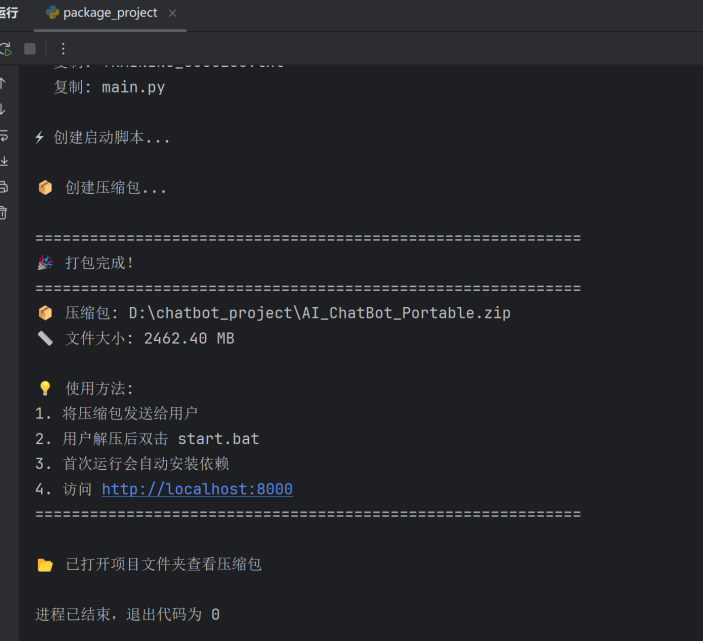
  <br>
  <em>打包完成，生成跨平台便携压缩包与使用说明</em>
</p>

---

## 四、环境要求与依赖

- **Python**：3.10 及以上（本项目在 3.11/3.12 下验证）
- **硬件**：CPU 即可运行；有 CUDA 时自动使用 GPU
- **磁盘**：模型权重 + 虚拟环境约需 5GB 以上

依赖以 `requirements.txt` 为准；实际运行 `scripts/model_training.py` 还需要 `jieba`，如进行训练请一并安装：

```
torch==2.9.1
transformers==4.44.2
datasets
fastapi
uvicorn
pydantic
pandas==2.2.2
numpy==1.26.4
scikit-learn==1.5.1
matplotlib==3.8.4
seaborn
redis>=5.0.0
```

安装：

```bash
pip install -r requirements.txt
```

---

## 五、快速开始

### 步骤 1：准备模型权重

将 Qwen2-0.5B-Instruct 下载到 `models/Qwen2-0.5B-Instruct/`：

- HuggingFace：`https://huggingface.co/Qwen/Qwen2-0.5B-Instruct`
- 或使用 ModelScope（国内镜像）下载后放置到相同目录

目录结构应为：

```
models/Qwen2-0.5B-Instruct/
├── config.json
├── model.safetensors
├── tokenizer.json
├── tokenizer_config.json
└── ...
```

### 步骤 2：安装依赖

```bash
pip install -r requirements.txt
```

### 步骤 3：启动推理服务（Web 对话）

```bash
python scripts/api_server.py
```

启动后访问：

- 聊天测试页：<http://localhost:8000/test-page>
- API 首页：<http://localhost:8000/>
- 接口文档：<http://localhost:8000/docs>
- 健康检查：<http://localhost:8000/health>

### 步骤 4：命令行对话

```bash
python chatbot.py
```

### 步骤 5：微调模型

```bash
python main.py                 # 依次执行 数据处理→训练→测试→可视化
# 或单独运行训练：
python scripts/model_training.py
```

### 步骤 6：测试与评估

```bash
python scripts/model_testing.py
```

### 步骤 7：一键打包

```bash
python package_project.py      # 生成 AI_ChatBot_Portable.zip（含 start.bat / start.sh）
```

---

## 六、配置说明

### 推理服务（`scripts/api_server.py`）

- `MODEL_PATH`：模型目录。默认指向 `models/Qwen2-0.5B-Instruct`（相对项目根目录自动解析），如需加载微调模型改为 `models/finetuned_model`。
- 监听地址：`0.0.0.0:8000`（可在文件末尾 `uvicorn.run` 处修改）。
- CORS：当前为 `allow_origins=["*"]`，便于本地联调；生产环境请收紧来源。

### 微调（`scripts/model_training.py`）

- 训练数据：`results/processed_train.csv`（由 `data_processing.py` 从 `data/train.csv` 生成）。
- 关键超参：`num_train_epochs=1`、`learning_rate=5e-6`、`per_device_train_batch_size=1`。
- 说明：脚本内当前默认仅取前 20 条样本用于最小可运行验证（`if len(train_dataset) > 20: train_dataset = train_dataset.select(range(20))`）。如需完整训练，请注释该截断逻辑。

### 对话接口（`POST /api/chat` 与 `POST /api/chat/stream`）

请求体（两个端点通用，`session_id` 可选）：

```json
{
  "messages": [
    { "role": "user", "content": "你好" }
  ],
  "max_tokens": 150,
  "temperature": 0.7,
  "top_p": 0.9,
  "session_id": "my-session-001"
}
```

- **`POST /api/chat`**：整句返回，`{ "reply": "...", "session_id": "..." }`。未传 `session_id` 时为无状态单轮（沿用原逻辑，仅保留最近 2 条用户消息）。
- **`POST /api/chat/stream`**：返回 `text/event-stream` 的 SSE 流，逐 token 推送，事件格式：
  ```text
  data: {"token": "你", "done": false}
  data: {"token": "好", "done": false}
  ...
  data: {"token": "", "done": true, "reply": "你好！...", "session_id": "my-session-001"}
  ```
  生成在后台线程执行，`TextIteratorStreamer` 负责逐 token 产出，前端可用 `fetch` + `ReadableStream` 读取（内置 `/test-page` 已演示）。

**多轮上下文（session_id）**：传入 `session_id` 后，服务端在 Redis 或进程内存中维护该会话的历史消息；客户端**每轮只需发送本次的新消息**（通常为一条 user 消息，首次可附带 system 设定人设）。历史随消息数自动裁剪至最近 `CONTEXT_MAX_TURNS`（默认 20）条。详见第七节会话管理端点。

curl 快速验证（流式）：

```bash
curl -N -X POST http://localhost:8000/api/chat/stream \
  -H "Content-Type: application/json" \
  -d '{"session_id":"demo","messages":[{"role":"user","content":"用一句话介绍北京"}],"max_tokens":120}'
```

### 上下文存储配置（Redis / 内存）

对话上下文默认保存在**进程内存**；若环境中运行了 Redis，可通过环境变量启用 Redis 后端（重启服务后仍可保留会话、支持跨进程共享）：

| 环境变量 | 默认值 | 说明 |
|----------|--------|------|
| `REDIS_ENABLED` | `auto` | `auto`=探测 Redis 可达性；`true`=强制启用；`false`=仅内存 |
| `REDIS_HOST` | `localhost` | Redis 主机 |
| `REDIS_PORT` | `6379` | Redis 端口 |
| `REDIS_DB` | `0` | Redis 库号 |
| `REDIS_TTL` | `3600` | 会话上下文过期时间（秒） |
| `CONTEXT_MAX_TURNS` | `20` | 单会话保留的最大消息条数 |

无 Redis 时服务照常运行（自动回退内存），仅重启后上下文清空；`/info` 与 `/health` 会返回当前 `context_backend` 便于排查。

---

## 七、API 端点一览

| 方法 | 路径 | 说明 |
|------|------|------|
| GET | `/` | 服务信息（模型状态、端点列表） |
| GET | `/health` | 健康检查 |
| GET | `/info` | 服务器信息（模型路径、设备、CUDA、PyTorch 版本） |
| POST | `/api/chat` | 核心对话接口（整句返回，支持 `session_id` 多轮上下文） |
| POST | `/api/chat/stream` | 流式对话接口（SSE 逐 token 输出） |
| GET | `/api/session/{id}` | 查看某会话的上下文消息列表 |
| DELETE | `/api/session/{id}` | 清理某会话的上下文 |
| POST | `/api/test` | 内置自测接口 |
| GET | `/test-page` | 内置 HTML 对话测试页（支持流式 + 多轮） |
| GET | `/docs` | Swagger 文档 |

---

## 八、项目优势

- **完全本地 / 离线**：模型权重与推理均在本地，不调用任何云端大模型 API，数据不出本机。
- **流式交互**：`/api/chat/stream` 提供 SSE 逐 token 输出，前端首字延迟低、体验接近主流对话产品。
- **多轮会话可缓存**：通过 `session_id` + Redis（可选）/ 内存维护上下文，支持跨请求记忆与会话管理。
- **轻量可跑**：0.5B 参数模型在普通 CPU 笔记本上即可运行，资源占用低。
- **端到端闭环**：从数据集、微调、推理服务、评估到打包部署，全流程脚本化、可复现。
- **开箱即用的界面**：内置 HTML 测试页与命令行两种交互方式，无需额外前端工程。
- **跨平台启动脚本**：提供 Windows（`start.bat`）与 Linux（`start.sh`）一键启动。

---

## 九、已交付能力对照（重要 · 与原始需求描述的一致性说明）

为避免在面试 / 评审中被追问时对不上，以下将「原始项目描述」与「代码实际实现」逐一对照。**本仓库严格以代码为准，未实现的功能不作夸大表述**。

| 原始描述 | 代码实际情况 | 结论 |
|----------|--------------|------|
| 基于 Qwen2-0.5B-Instruct，Transformers+PyTorch | `api_server.py` / `chatbot.py` / `model_training.py` 均使用 Transformers + PyTorch 加载 Qwen2-0.5B-Instruct | ✅ 已实现 |
| 多轮对话管理 | `api_server.py` 通过 `session_id` + `ContextStore` 维护会话历史；`chatbot.py` 维护 `conversation_history` | ✅ 已实现（API 侧支持跨请求多轮记忆，无 session 时为无状态） |
| **流式生成** | `POST /api/chat/stream` 使用 `StreamingResponse` + SSE + `TextIteratorStreamer`，后台线程执行 `model.generate` 逐 token 推送 | ✅ 已实现 |
| 模型微调、推理部署全流程 | `model_training.py` 微调 + `api_server.py` 部署 | ✅ 已实现（微调默认仅 20 条样本、1 epoch，属最小验证） |
| **引入 Redis 缓存对话上下文，优化时延与并发** | `ContextStore` 支持 Redis 后端（环境变量启用），连接失败时自动回退进程内存；上下文带 TTL，支持跨进程/跨实例共享 | ✅ 已实现（Redis 为可选依赖，未装/未运行则回退内存） |
| 工程化启动程序、环境校验、依赖管理、一键打包 | `main.py` 做依赖校验；`package_project.py` 生成 `AI_ChatBot_Portable.zip`（含 start.bat / start.sh） | ✅ 已实现（见下方已知限制） |
| Windows / Linux 跨平台部署包 | 已生成 `start.bat` 与 `start.sh` | ✅ 已生成，但**非完全离线 / 可移植**（见已知限制） |
| 训练与性能可视化报告、全链路评估 | `visualization_new.py` 出图；`model_testing.py` 输出词重叠基线评估 | ✅ 已实现（评估为基线级，指标为例示数据，见已知限制） |

---

## 十、复现本项目所需配置与依赖库

**模型权重（必须，不入库）**：将 Qwen2-0.5B-Instruct 放置到 `models/Qwen2-0.5B-Instruct/`（来源见第五节步骤 1）。微调产物保存至 `models/finetuned_model/`。

**依赖库**：见第四节 `requirements.txt`（已补全 `fastapi` / `uvicorn` / `pydantic` / `datasets` / `seaborn` 等原清单缺失项，确保克隆后可安装运行）。

**数据**：`data/train.csv` 与 `data/test.csv` 为 `input,response` 两列的对话样本（ChatterBot 风格中文语料），已随仓库提供；运行 `data_processing.py` 生成 `results/processed_*.csv`。

---

## 十一、已知限制与未来发展方向

**已知限制（如实说明）**

1. **Redis 为可选组件**：对话上下文默认存于进程内存，重启即丢失；仅在设置了 `REDIS_ENABLED=true`（或 `auto` 且环境可达）并运行 Redis 时才走 Redis 后端。未装 `redis` 包或未启动 Redis 时自动回退内存，属预期行为。
2. **流式输出首字仍有模型前向耗时**：`/api/chat/stream` 的逐 token 来自 `TextIteratorStreamer`，但首字需等待一次完整前向；0.5B 模型在 CPU 上首字约数百毫秒至 1 秒级。
3. **可视化指标为例示数据**：`visualization_new.py` 中的损失、准确率、混淆矩阵、响应时间、测试结果为固定示例数组，并非真实测评结果；README 已将这些示例指标图从展示中移除。`model_testing.py` 的自动评估仅为词重叠基线（5 条样本，相似度通常接近 0），用于演示流程。
4. **打包产物非完全离线 / 可移植**：`start.bat` / `start.sh` 仍依赖首次联网 `pip install`；`api_server.py` 早期版本模型路径为硬编码绝对路径（已改为相对路径自动解析）；打包脚本原引用了不存在的 `visualization_server.py`（已修正为 `visualization_new.py`）。
5. **微调规模小**：默认仅 20 条样本、1 epoch，属于可运行验证，非充分训练。

**未来发展方向**

- 引入 LoRA / QLoRA 降低微调显存占用，并扩大训练数据规模。
- 将可视化与评估报告对接真实测评指标（BLEU / ROUGE / 人工打分）。
- 打包时内置依赖与模型下载引导，做到真正离线可分发的便携包。

---

## 界面与功能演示

以下截图展示了实际运行界面，包括 API 文档、Web 对话、代码示例、系统状态、发送状态、服务信息、对话日志与模型测试结果。

### API 文档

| API 首页 | `/api/chat` 接口详情 |
|:---:|:---:|
| 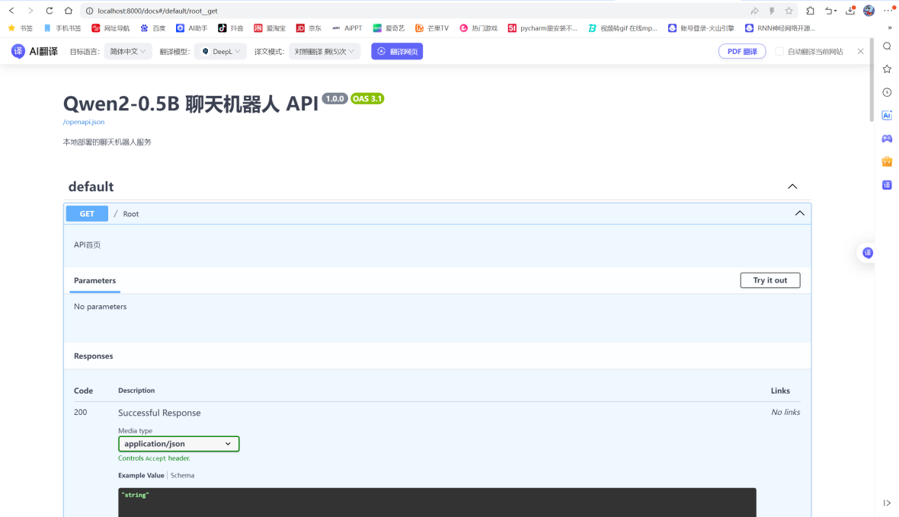 | 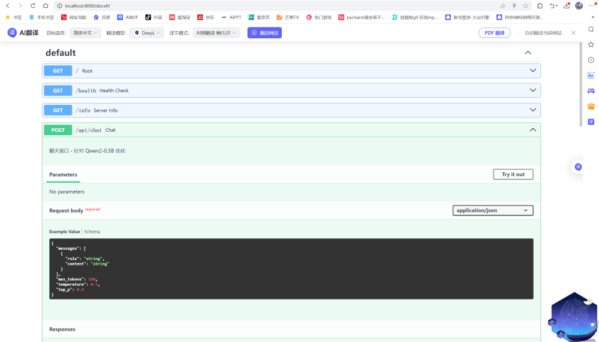 |
| Swagger UI 首页 | POST /api/chat 请求与响应结构 |

### Web 对话界面

| 主界面 | 多轮对话示例 |
|:---:|:---:|
| 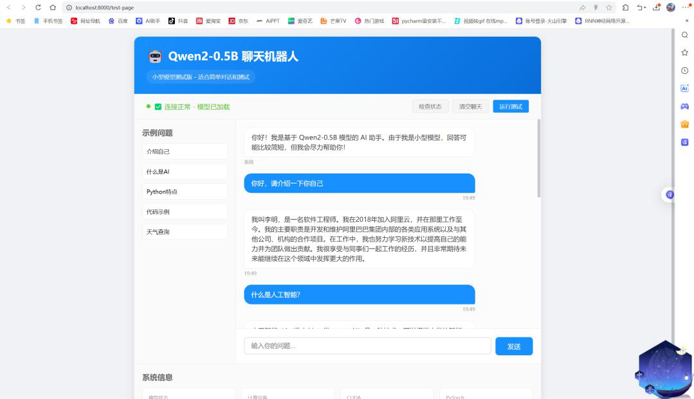 | 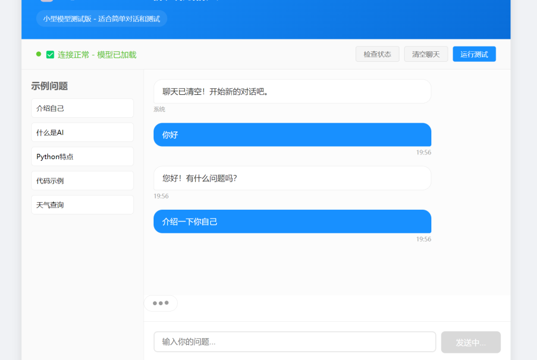 |
| 示例问题快捷入口 + 对话区域 | “你好 / 介绍一下你自己”对话交互 |

| 代码示例 | 系统状态 |
|:---:|:---:|
| 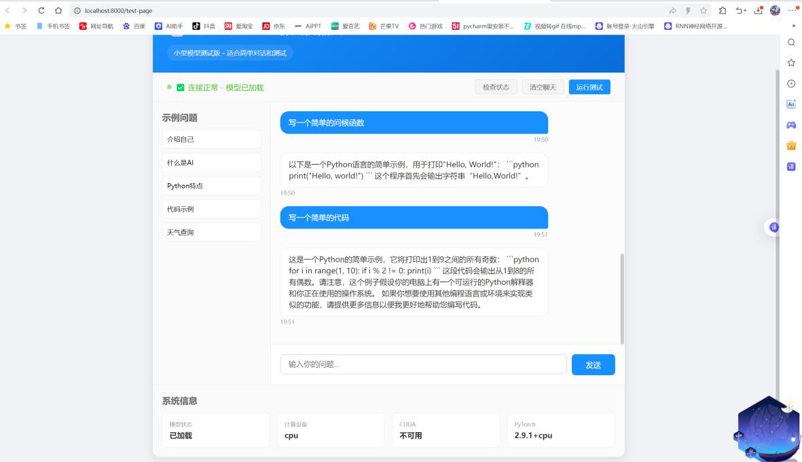 | 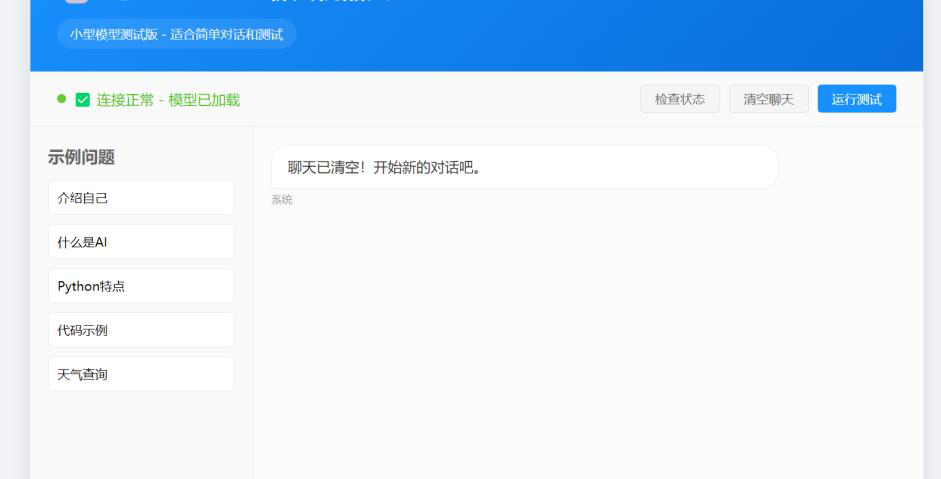 |
| 请求“写一个简单的问候函数” | 模型加载与连接状态 |

| 发送中状态 |
|:---:|
| 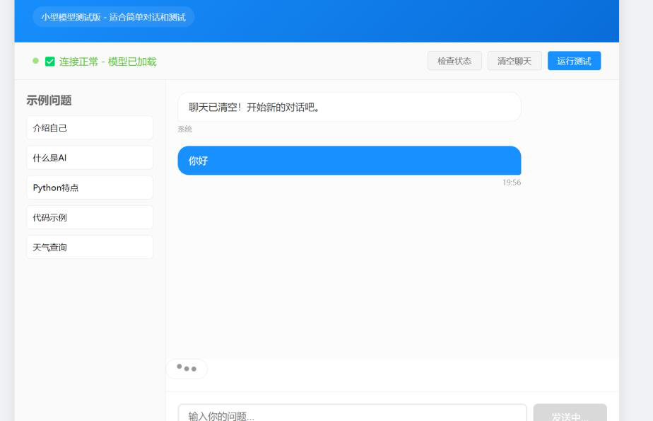 |
| 输入“你好”后，界面显示生成中的实时反馈 |

### 服务信息、日志与测试结果

| 服务器启动信息 | 终端对话日志 |
|:---:|:---:|
| 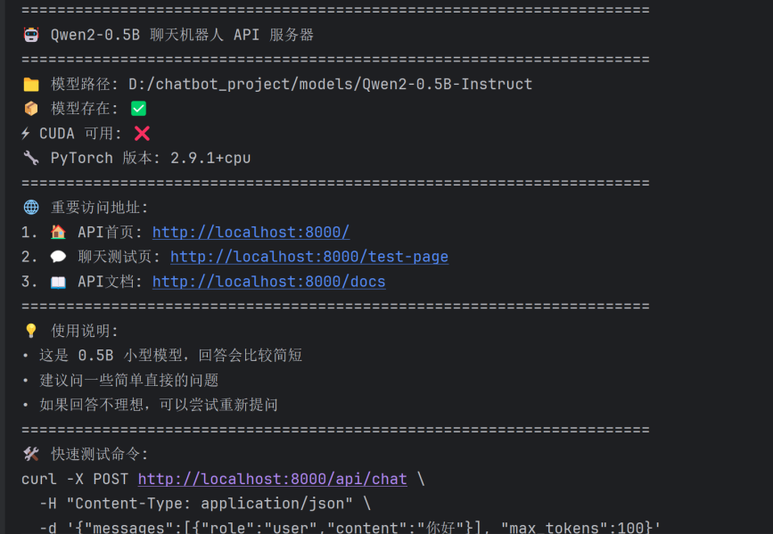 | 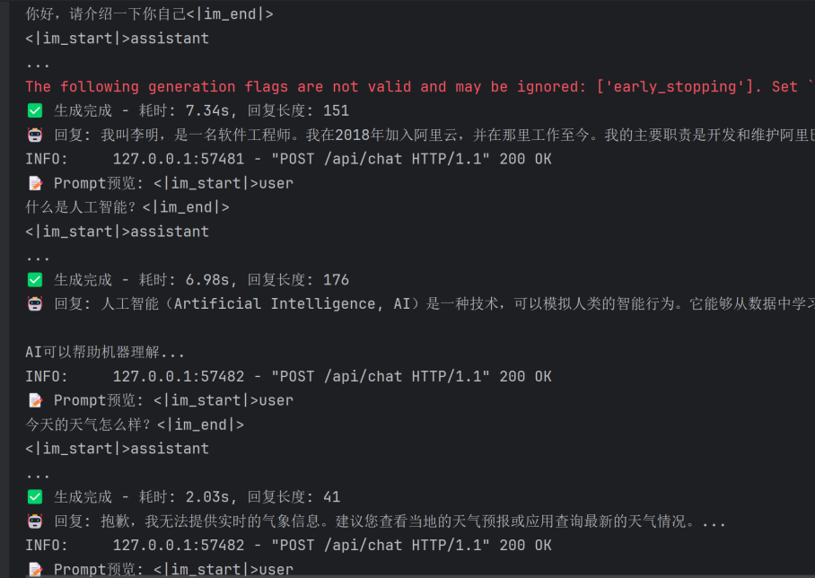 |
| API 服务启动后的终端信息 | 服务端记录的对话历史 |

| 模型测试结果 |
|:---:|
| 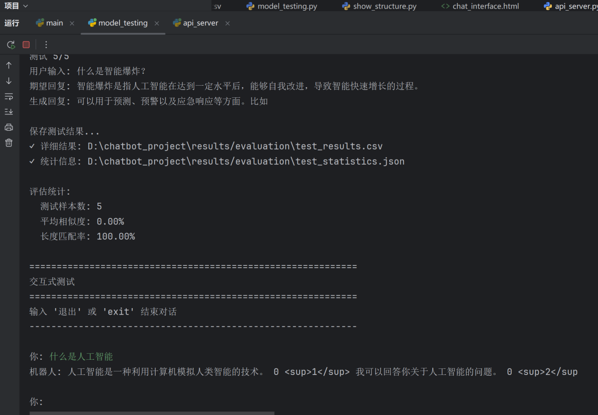 |
| model_testing.py 输出的测试样本数、相似度与长度匹配率统计 |

---

## 十二、许可证

本项目用于学习与演示，模型权重请遵循 Qwen2-0.5B-Instruct 原作者的许可协议（Apache 2.0）使用。
